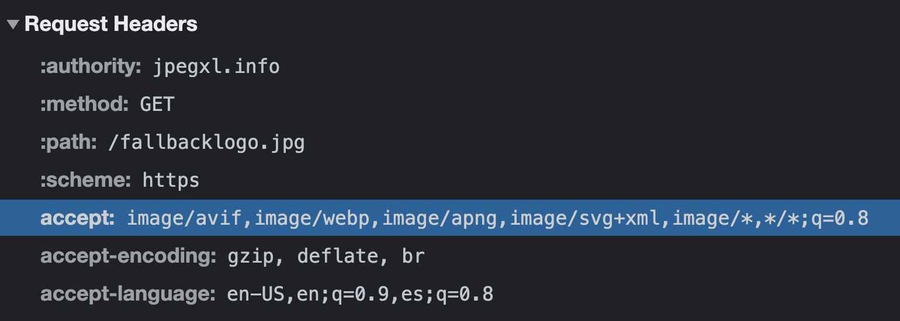

# image-element

Repository to collect best practices for web images

## Responsive images

### With media

We can use `media` to define a media query as a breakpoint to load a responsive image.

```html
<picture>
  <source srcset="image-wide.jpg" media="(min-width: 600px)">
  <source srcset="image-ultrawide.jpg" media="(min-width: 1200px)">
  <!-- The  tag is a fallback image (required in the <picture> tag) -->
  
</picture>
```

> In the above code, the browser loads the `image.jpg` in mobile version, the `image-wide.jpg` in tablets resolutions or bigger, and the `image-ultrawide.jpg` will be loaded in screen resolutions bigger than 1200px.

### With sizes

We can use [`sizes`](https://developer.mozilla.org/en-US/docs/Web/API/HTMLImageElement/sizes), that allows you to specify the layout width of the image for a list of media conditions.

```html

```

> In the above code (like with `media`), the browser loads the `image.jpg` in mobile version, the `image-wide.jpg` in tablets resolutions or bigger, and the `image-ultrawide.jpg` will be loaded in screen resolutions bigger than 1200px.

## Serve modern image formats

> Usually, the next-gen image formats like [`WebP`](https://developers.google.com/speed/webp), [`AVIF`](https://aomediacodec.github.io/av1-avif/) or [`JPEG XL`](https://jpeg.org/jpegxl/), can optimize image weight while maintaining good image quality.

With the HTML tag `<picture>` we can specify the `type` in the `<source>` tag. The type is the image format, and we can use it to serve modern image formats. The browser will use the first image format that it supports.

```html
<picture>
  <source type="image/webp" srcset="image.webp">
  <source type="image/jpeg" srcset="image.jpg">
  <!-- The  tag is a fallback image (required in the <picture> tag) -->
  
</picture>
```

> In the above code, the browser loads the first image format that it can render. E.g. Internet Explorer 11 nor Safari 13 can't load the [WebP](https://developers.google.com/speed/webp) image format (a next-gen image format), so they will load the `JPEG` image. 

```html
<picture>
  <source type="image/jxl" srcset="image.jxl">
  <source type="image/avif" srcset="image.avif">
  <source type="image/webp" srcset="image.webp">
  <source type="image/jpeg" srcset="image.jpg">
  <!-- The  tag is a fallback image (required in the <picture> tag) -->
  
</picture>
```

> In the above code, we list all the modern image formats, from "more optimized" to "less optimized". The browser will show the first image that it can load and render.

## Serve responsive and modern image formats

We can combine both approaches to serve modern image formats and responsive images to load the best image on each device.

```html
<picture>
  <source
    sizes="(min-width: 600px) 100vw, 600px,
           (min-width: 1200px) 100vw, 1200px"
    srcset="image-wide.jpg 600w,
            image-ultrawide.jpg 1200w"
    type="image/jxl">
  <source
    sizes="(min-width: 600px) 100vw, 600px,
           (min-width: 1200px) 100vw, 1200px"
    srcset="image-wide.avif 600w,
            image-ultrawide.avif 1200w"
    type="image/avif">
  <source
    sizes="(min-width: 600px) 100vw, 600px,
           (min-width: 1200px) 100vw, 1200px"
    srcset="image-wide.webp 600w,
            image-ultrawide.webp 1200w"
    type="image/webp">
  <source
    sizes="(min-width: 600px) 100vw, 600px,
           (min-width: 1200px) 100vw, 1200px"
    srcset="image-wide.jpg 600w,
            image-ultrawide.jpg 1200w"
    type="image/jpeg">
  <!-- The  tag is a fallback image (required in the <picture> tag) -->
  
</picture>
```
> In the above code, we have a combination of all modern image formats and the sizes needed. This is an example, as every site or project needs different sizes.

## Improve the Web Performance

We can use several attributes to improve the Web Performance, aka **user experience**.

- [`loading`](https://developer.mozilla.org/en-US/docs/Web/API/HTMLImageElement/loading) provides a hint to the user agent on how to handle the loading of the image which is currently outside the window's visual viewport. We can set it to `eager` (default value) which tells the browser to load the image as soon as the `` element is processed, or `lazy` that tells the user agent to hold off on loading the image until the browser estimates that it will be needed imminently.
- [`decoding`](https://developer.mozilla.org/en-US/docs/Web/API/HTMLImageElement/decoding) represents a hint given to the browser on how it should decode the image. The values are `sync` to decode the image synchronously for atomic presentation with other content, `async` to decode the image asynchronously and reduce delay in presenting other content, and `auto` (default mode) which indicates no preference for the decoding mode. The browser decides what is best for the user.
- [`fetchpriority`](https://developer.mozilla.org/en-US/docs/Web/API/HTMLImageElement/fetchPriority) represents a hint given to the browser on how it should prioritize the fetching of the image relative to other images. The values are `high` to fetch the image at a high priority relative to other images, `low` to fetch the image at a low priority relative to other images, and `auto` (default mode) which indicates no preference for the fetch priority. The browser decides what is best for the user.

### Now we will use this attributes to improve the user experience of our images

```html
<picture>
  <source
    sizes="(min-width: 600px) 100vw, 600px,
           (min-width: 1200px) 100vw, 1200px"
    srcset="image-wide.jpg 600w,
            image-ultrawide.jpg 1200w"
    type="image/jxl">
  <source
    sizes="(min-width: 600px) 100vw, 600px,
           (min-width: 1200px) 100vw, 1200px"
    srcset="image-wide.avif 600w,
            image-ultrawide.avif 1200w"
    type="image/avif">
  <source
    sizes="(min-width: 600px) 100vw, 600px,
           (min-width: 1200px) 100vw, 1200px"
    srcset="image-wide.webp 600w,
            image-ultrawide.webp 1200w"
    type="image/webp">
  <source
    sizes="(min-width: 600px) 100vw, 600px,
           (min-width: 1200px) 100vw, 1200px"
    srcset="image-wide.jpg 600w,
            image-ultrawide.jpg 1200w"
    type="image/jpeg">
  <!-- The  tag is a fallback image (required in the <picture> tag) -->
  
</picture>
```

> In the above code, we have a better code for all the images below the fold (outside the viewport) and the browser does not load these images (according to the [threshold](https://github.com/chromium/chromium/blob/main/third_party/blink/renderer/core/frame/settings.json5#L936-L968))

### Improve the image detected as [LCP](https://web.dev/lcp) element of the Core Web Vitals

The previous code covers the scenario for all images outside of the viewport. Usually, the [LCP](https://web.dev/lcp) metric refers to an image element, so we can iterate to improve it.

```html
<picture>
  <source
    sizes="(min-width: 600px) 100vw, 600px,
           (min-width: 1200px) 100vw, 1200px"
    srcset="image-wide.jpg 600w,
            image-ultrawide.jpg 1200w"
    type="image/jxl">
  <source
    sizes="(min-width: 600px) 100vw, 600px,
           (min-width: 1200px) 100vw, 1200px"
    srcset="image-wide.avif 600w,
            image-ultrawide.avif 1200w"
    type="image/avif">
  <source
    sizes="(min-width: 600px) 100vw, 600px,
           (min-width: 1200px) 100vw, 1200px"
    srcset="image-wide.webp 600w,
            image-ultrawide.webp 1200w"
    type="image/webp">
  <source
    sizes="(min-width: 600px) 100vw, 600px,
           (min-width: 1200px) 100vw, 1200px"
    srcset="image-wide.jpg 600w,
            image-ultrawide.jpg 1200w"
    type="image/jpeg">
  <!-- The  tag is a fallback image (required in the <picture> tag) -->
  
</picture>
```

> In the above code, we changed the attribute `decoding` to `sync` to priorize the decoding, removed the attribute `loading` because the default behavior is `eager`, so we don't need it, and we add the attribute `fetchpriority="high"` to indicate to the browser to load the image as soon as possible.

> By the way, we don't need to add these attributes to all `<source>` tags, only to `` tags.

## Use a CDN Image Service

We see that we need a lot of code to deliver the best user experience 🙈.

We can use a CDN Image Service like [Cloudinary](https://cloudinary.com/) to remove the part of code that references the image format, as these services serve the best image format supported by the browser.

The browser sends in the [HTTP Headers](https://developer.mozilla.org/en-US/docs/Web/HTTP/Headers) the [`accept`](https://developer.mozilla.org/en-US/docs/Web/HTTP/Headers/Accept) header value to indicate which content types, expressed as [MIME types](https://developer.mozilla.org/en-US/docs/Web/HTTP/Basics_of_HTTP/MIME_types).



> In the screenshot above we see that my current version browser supports `image/avif,image/webp,image/apng,image/svg+xml,image/*,*/*;`, so with a service of automatic image format, the service will send me an `avif` image format in response.

```html
<picture>
  
</picture>
```

> Now we don't need to define the type because this is transparent to us. The service sends the best image format supported by the browser. Notice that the image in the samples is an `PNG` image, yet the browser will load an `avif` image format.

<hr>

## Acknowledgement

- [Addy Osmani](https://github.com/addyosmani), for this [image](images/image-addy-osmani.jpg) and for all the tips that he are sharing with the community.
